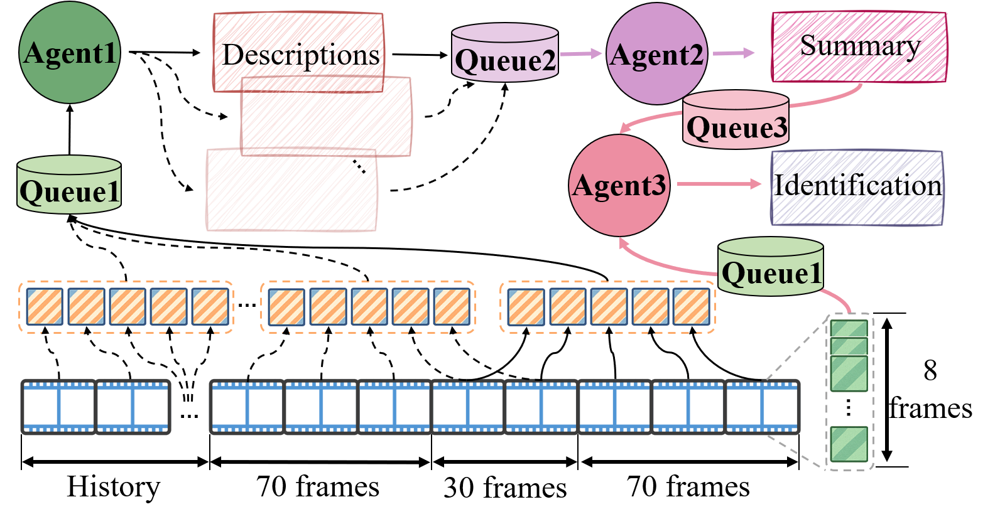
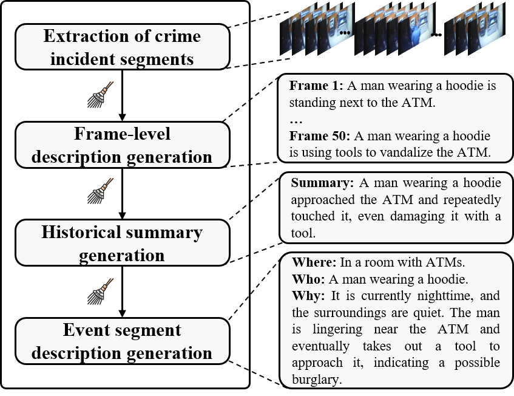

# MA-CBP

 

Official repositories for "MA-CBP: A Criminal Behavior Prediction Framework Based on Multi-Agent Asynchronous Collaboration".

## 📰 News
* `2025/08/08` 🔥 Our paper is available on [Arxiv](https://arxiv.org/abs/2508.06189)!
* `2025/08/13` 🔥 Our datasets are available on [🤗Huggingface](https://hf-mirror.com/datasets/ltxBIT/MA_CBP_dataset/tree/main)!

## ✨Highlights
* We propose a pioneering early warning framework for criminal behavior based on LLMs, overcoming the limitations of existing methods that fail to simultaneously achieve deep understanding of historical behavior semantics and meet the requirements for practical deployment.

* We propose a real-time reasoning agent, which performs joint short-term and long-term inference by integrating historical summaries with current visual information, and generates structured decisions regarding potential criminal behavior.

* We have constructed a high-quality criminal behavior dataset that covers four categories of abnormal events and includes fine-grained natural language annotations, providing strong data support for research on criminal behavior prediction.

## 📊 Data instruction
* Our dataset is available on [🤗Huggingface](https://hf-mirror.com/datasets/ltxBIT/MA_CBP_dataset/tree/main).
* The original videos were selected from the UCF-Crime, CamNuvem datasets and YouTubeClips-80K.
* In order to construct a dataset for different agents, we designed corresponding prompts based on their specific tasks, including image description, summary, and event description.
